# AWS CloudWatch Monitoring

EC2 CPU alarm and SNS email notification project built on a live AWS account in **eu-west-1 (Ireland)**. The goal was to set up a real monitoring pipeline that automatically detects when an EC2 instance is under heavy CPU load and sends an email alert - without writing a single line of code. Everything was configured through the AWS Console.


**Total cost: €0.00 - all resources within AWS Free Tier.**

## Pipeline Overview

```
EC2 Instance → CloudWatch Alarm → SNS Topic → Email Alert
```

## Architecture

```
┌─────────────────────────────────────────────────────────────┐
│                     AWS eu-west-1 (Ireland)                  │
│                                                              │
│   ┌─────────────────────┐                                    │
│   │   EC2 Instance      │                                    │
│   │   Cloudwatch-Demo   │──── CPUUtilization ────┐           │
│   │   t3.micro          │     every 60 seconds   │           │
│   │   Amazon Linux 2023 │                        ▼           │
│   └─────────────────────┘           ┌────────────────────┐  │
│                                     │  CloudWatch Alarm  │  │
│                                     │  CPU-High_Alert    │  │
│                                     │  CPU > 50%         │  │
│                                     │  Period: 1 minute  │  │
│                                     │  Statistic: Avg    │  │
│                                     └────────────────────┘  │
│                                              │               │
│                                        IN ALARM              │
│                                              ▼               │
│                                  ┌─────────────────────┐    │
│                                  │     Amazon SNS      │    │
│                                  │  cloudwatch-alarm-  │    │
│                                  │       topic         │    │
│                                  │   Standard Type     │    │
│                                  └─────────────────────┘    │
│                                              │               │
└──────────────────────────────────────────────┼───────────────┘
                                               ▼
                                  ┌─────────────────────┐
                                  │   Gmail Inbox       │
                                  │  ALARM: CPU-High_   │
                                  │  Alert in EU        │
                                  │  CPU: 99.93%        │
                                  │  OK → IN ALARM      │
                                  └─────────────────────┘
```

## How It Works

EC2 automatically sends `CPUUtilization` metrics to CloudWatch every 60 seconds - no configuration needed, it just works out of the box. CloudWatch evaluates that data every minute against the threshold I set. The moment CPU goes above 50% for one consecutive minute, the alarm transitions from `OK` to `IN ALARM` and publishes a message to the SNS topic. SNS then delivers that as a formatted email to my Gmail, usually within 60 seconds of the breach.

| Step | Service | What Happens |
|------|---------|--------------|
| 1 | EC2 | Sends `CPUUtilization` to CloudWatch every 60 seconds automatically |
| 2 | CloudWatch | Evaluates average CPU every 1 minute against the 50% threshold |
| 3 | CloudWatch Alarm | Transitions `OK → IN ALARM` when CPU exceeds 50% for 1 consecutive minute |
| 4 | SNS Topic | CloudWatch publishes a message to `cloudwatch-alarm-topic` |
| 5 | SNS Subscription | SNS formats and delivers the email to `venkaiahmalli96@gmail.com` |
| 6 | Gmail | Alarm email arrives with CPU value, timestamp, instance ID, and console link |

## AWS Resources

| Resource | Name | Details |
|----------|------|---------|
| EC2 Instance | Cloudwatch-Demo | t3.micro, Amazon Linux 2023, eu-west-1 |
| CloudWatch Alarm | CPU-High_Alert | CPUUtilization > 50%, 1-minute period, Average statistic |
| SNS Topic | cloudwatch-alarm-topic | Standard type, Email protocol |
| Email Subscription | venkaiahmalli96@gmail.com | Confirmed - receives all alarm notifications |

## Alarm Configuration

| Setting | Value | Why |
|---------|-------|-----|
| Metric | CPUUtilization | Tracks the percentage of EC2 CPU in use at any point in time |
| Namespace | AWS/EC2 | Standard grouping for all EC2 metrics in CloudWatch |
| Statistic | Average | Mean CPU across all readings in the 1-minute window |
| Period | 1 minute | Faster detection than the default 5-minute period |
| Threshold Type | Static | Compare against a fixed value, not ML-based dynamic thresholds |
| Condition | Greater than | Fires when CPU strictly exceeds the threshold value |
| Threshold Value | 50% | Low enough to breach during a stress test; realistic for production alerting |
| Datapoints to Alarm | 1 out of 1 | Fires on first breach - use 3 out of 3 in production to reduce false alarms |

### Alarm State Lifecycle

```
Created → INSUFFICIENT DATA → OK → IN ALARM
           (no data yet)     (CPU   (CPU > 50%,
                             < 50%)  SNS fires)
```

| State | Meaning |
|-------|---------|
| `INSUFFICIENT_DATA` | Initial state after creation - CloudWatch has not yet received any data |
| `OK` | CPU is below 50% - instance running normally, no action taken |
| `IN ALARM` | CPU crossed 50% for 1 consecutive minute - SNS notification sent to Gmail |

## Step-by-Step Implementation

### Step 1 - Launch EC2 Instance

The EC2 instance is the resource being monitored. I went with a `t3.micro` on Amazon Linux 2023 - Free Tier eligible, no cost, and more than enough for a CPU stress test. I made sure to enable a public IP because EC2 Instance Connect needs it to open a browser terminal to the instance. I also restricted SSH to my IP only - it is a bad habit to leave port 22 open to the whole internet, even for a short-lived lab instance.

| Setting | Value |
|---------|-------|
| Name | Cloudwatch-Demo |
| AMI | Amazon Linux 2023 - latest version with kernel 6.1 |
| Instance Type | t3.micro - 2 vCPUs, 1 GB RAM - Free Tier eligible |
| Key Pair | cloudwatch-key (RSA, .pem - downloaded to local Downloads folder) |
| VPC | Default VPC - default subnets in eu-west-1 |
| Auto-assign Public IP | Enabled - required for EC2 Instance Connect |
| Security Group | New - Allow SSH (TCP port 22) from My IP address only |
| Storage | Default 8 GB gp3 SSD - no changes required |

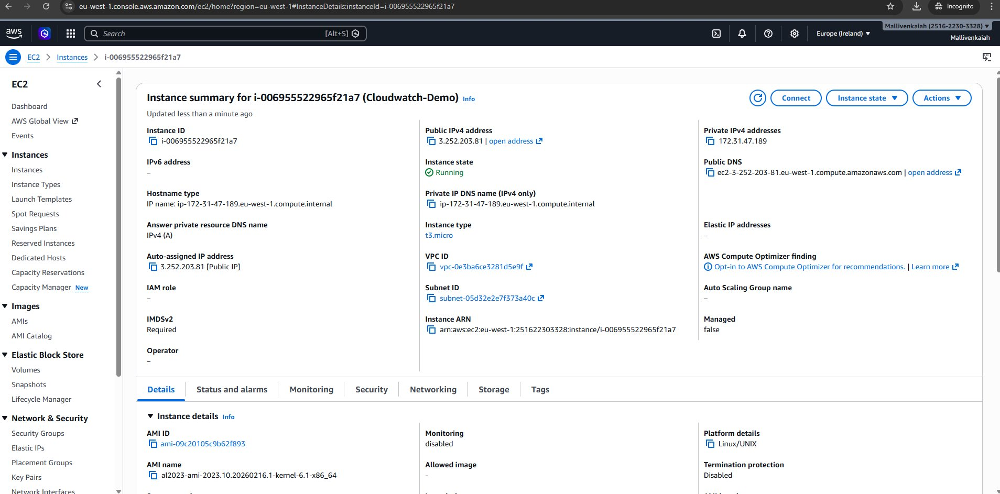
*Figure 1.1 - EC2 instance Cloudwatch-Demo in Running state - Instance ID: i-006955522965f21a7*

### Step 2 - Create SNS Topic and Email Subscription

SNS is what actually sends the notification. I set this up before creating the alarm because the alarm needs a destination to publish to - you cannot point an alarm at an SNS topic that does not exist yet.

I created a **Standard topic** (not FIFO - order does not matter for alerts) and subscribed my Gmail address. The important thing here is the **confirmation step** - AWS sends a confirmation email immediately after you create the subscription, and you must click the link in it. Until you do, the subscription sits in `Pending confirmation` state and no alarm emails will ever arrive.

| Setting | Value |
|---------|-------|
| Topic Type | Standard - supports Email, HTTP/S, Lambda, SQS, SMS, Mobile Push |
| Topic Name | cloudwatch-alarm-topic |
| Protocol | Email |
| Endpoint | venkaiahmalli96@gmail.com |
| All other settings | Left as default - no encryption or delivery policy required |

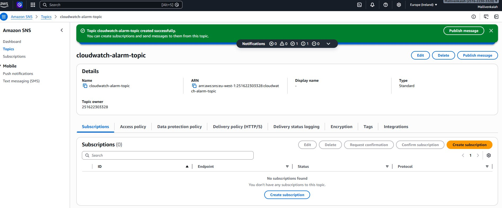

*Figure 2.1 - SNS topic cloudwatch-alarm-topic created successfully*

After the topic was created, I added my email as a subscriber. The status immediately shows `Pending confirmation`.

*Figure 2.2 - SNS subscription created - Status: Pending confirmation*

AWS sent the confirmation email to my Gmail within seconds. I opened it and clicked **Confirm subscription**. Until this is done, the subscription is inactive and alarm notifications will not arrive.

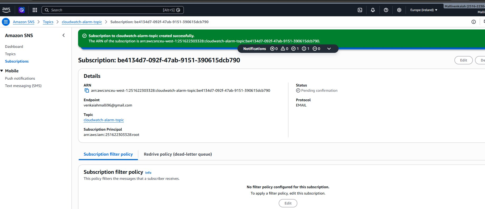
*Figure 2.3 - AWS Subscription Confirmation email received in Gmail*

Once confirmed, the subscription status updated to `Confirmed` and the topic was ready to receive alarm messages.


*Figure 2.4 - SNS subscription status: Confirmed - ready to receive alarm notifications*

### Step 3 - Create CloudWatch Alarm

This is the core of the project. The alarm watches the `CPUUtilization` metric for my specific EC2 instance and evaluates it every minute. When the CPU average crosses 50% for one consecutive minute, the alarm fires and CloudWatch tells SNS to send the email. I do not need to do anything after setup - it monitors on its own, even at 3am.

I navigated to **CloudWatch → Alarms → Create alarm → Select metric → EC2 → Per-Instance Metrics**, searched for my instance ID, and selected the `CPUUtilization` row.

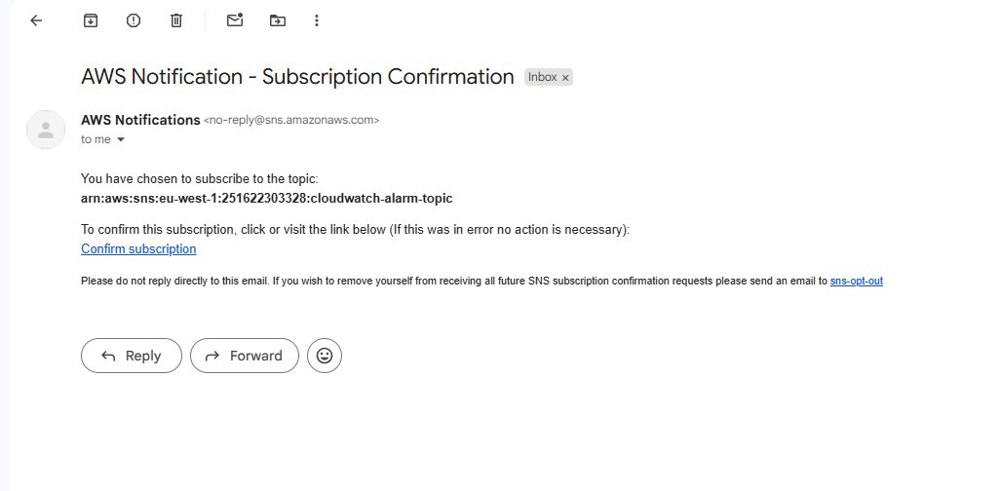
*Figure 3.1 - CPUUtilization metric selected for instance Cloudwatch-Demo*

I changed the period from the default 5 minutes down to **1 minute** for faster detection, and set the threshold to **50%** - low enough to breach easily in a stress test, realistic enough for a real production alert.

| Setting | Value |
|---------|-------|
| Period | 1 minute - evaluates CPU every 60 seconds (default is 5 minutes) |
| Statistic | Average - mean CPU across all data points in the 1-minute window |
| Threshold Type | Static - fixed value comparison |
| Condition | Greater than - fires when CPU strictly exceeds the threshold |
| Threshold Value | 50 - alarm fires when average CPU is above 50% |
| Datapoints to Alarm | 1 out of 1 - fires after the first breach |

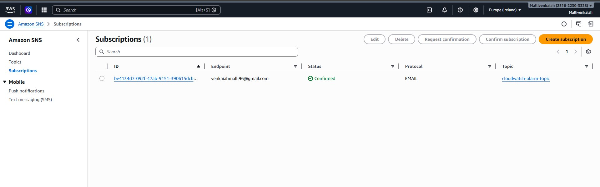
*Figure 3.2 - Alarm conditions: CPUUtilization > 50 | Period: 1 minute | Statistic: Average*

On the next screen I set the alarm action to **In alarm** and selected `cloudwatch-alarm-topic`. My confirmed email address appeared underneath automatically - CloudWatch reads it directly from the SNS subscription.

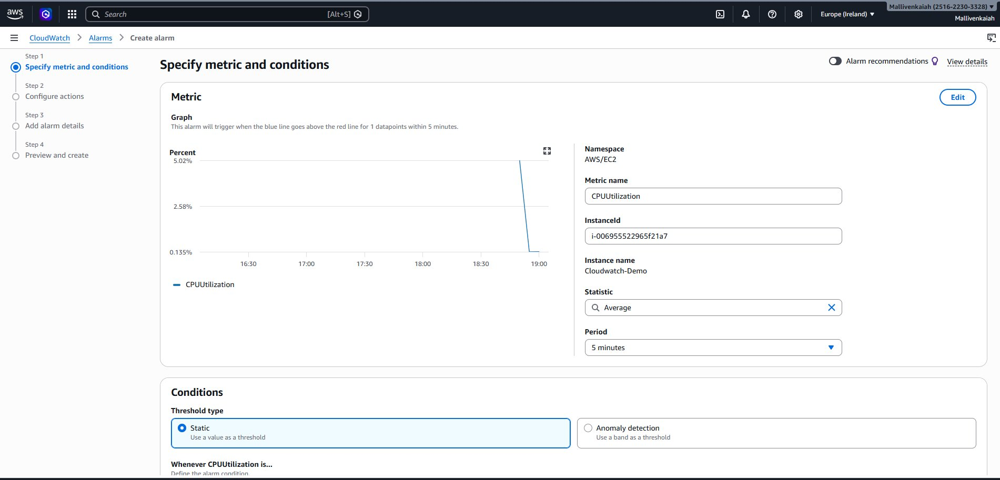
*Figure 3.3 - SNS action configured: In alarm state triggers cloudwatch-alarm-topic*

After creation the alarm shows **Insufficient data** - this is expected and normal. CloudWatch needs at least one 1-minute data point before it can evaluate the condition. It transitioned to `OK` within about 2 minutes once the instance started sending metrics.

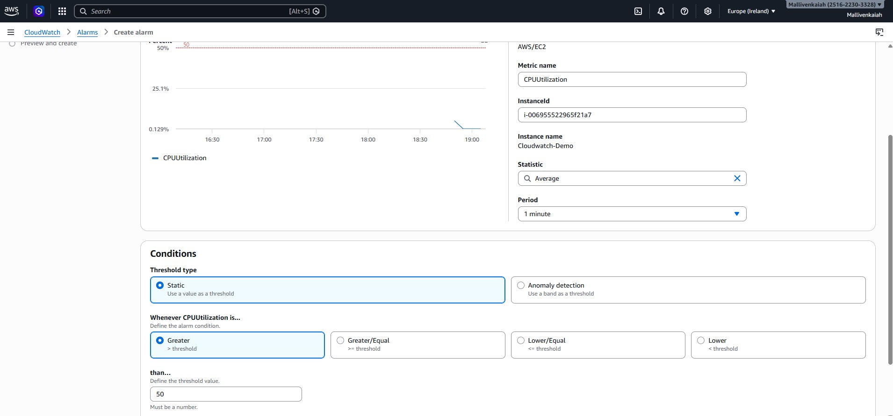
*Figure 3.4 - CloudWatch alarm CPU-High_Alert created - initial state: Insufficient data*

### Step 4 - Connect to EC2 and Run Stress Test

To verify the alarm actually works, I needed to push the CPU above 50% on purpose. I used **EC2 Instance Connect** - a browser-based terminal that opens directly in the AWS Console. No PuTTY, no local SSH setup, no key file needed. I just clicked **Connect** on the instance page and a terminal opened in the browser.

I then installed `stress` - a Linux tool that artificially loads the CPU - and ran it with 2 workers for 5 minutes. Two workers because the `t3.micro` has 2 vCPUs, so each worker maxes out one core. Five minutes gives CloudWatch enough time to detect the spike and confirm the alarm.

**Install stress tool:**
```bash
sudo yum install stress -y
```

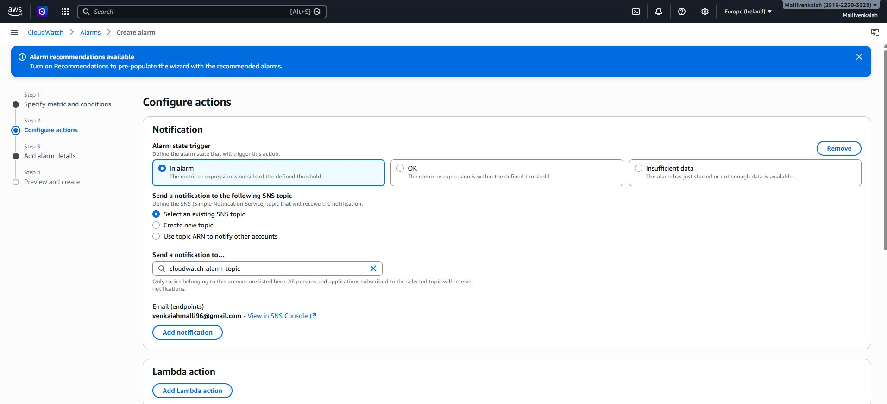
*Figure 4.1 - Stress tool installed: stress 1.0.7 from Amazon Linux repository*

**Run the stress test:**
```bash
stress -c 2 -t 300
```

| Parameter | Value | Explanation |
|-----------|-------|-------------|
| `-c 2` | 2 CPU workers | One per vCPU on t3.micro - both cores hit 100% immediately |
| `-t 300` | 300 seconds | 5 minutes - enough for CloudWatch to detect the spike and confirm the alarm |
| Result | 99.93% CPU | CloudWatch measured this on the next 1-minute check |

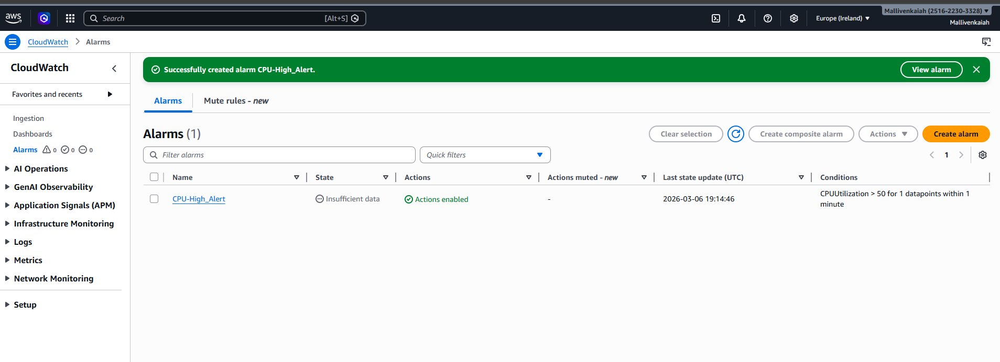
*Figure 4.2 - Stress running: dispatching hogs: 2 cpu - both vCPUs under full load*

### Step 5 - Alarm Triggered (IN ALARM State)

About 2 minutes after starting the stress test, the alarm changed state. CloudWatch measured the CPU average at **99.93%** - well above the 50% threshold - and moved the alarm from `OK` to `IN ALARM`. The CloudWatch dashboard went red, the alarm listed EC2 as having 1 active alarm, and the CPU graph showed a sharp spike crossing the threshold line.

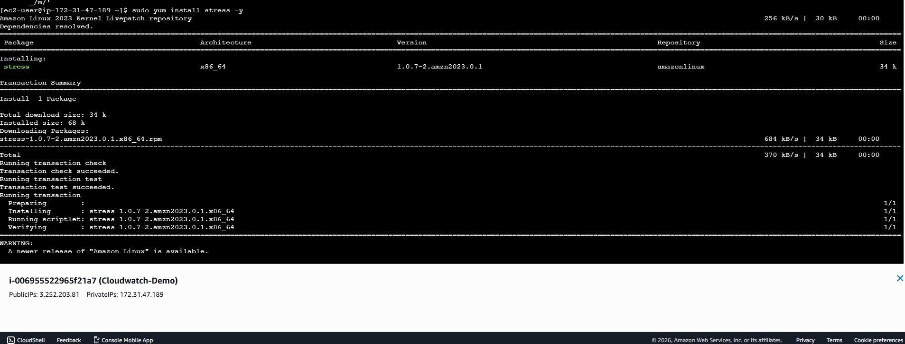
*Figure 5.1 - CloudWatch Overview: CPU-High_Alert IN ALARM - EC2 showing 1 active alarm*

The CPU graph clearly shows the line flat near zero, then a sharp vertical spike to nearly 100% the moment the stress test started, staying well above the red 50% threshold line.

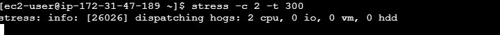
*Figure 5.2 - CPU utilisation graph: spike above the 50% threshold - breach clearly visible*

```
Alarm triggered at:  19:21:40 UTC - 06 March 2026
CPU at breach:       99.93%
State change:        OK → IN ALARM
Time to alarm:       ~2 minutes after stress test started
```

### Step 6 - Email Notification Received

The alarm email arrived in my Gmail approximately **1 minute** after the alarm fired. It came from AWS Notifications and contained everything you would want in a real incident - the exact CPU value that triggered it, the timestamp, the instance ID, the alarm name, the region, and a direct link to the alarm in the AWS Console. This is exactly what the on-call engineer would receive at 3am.

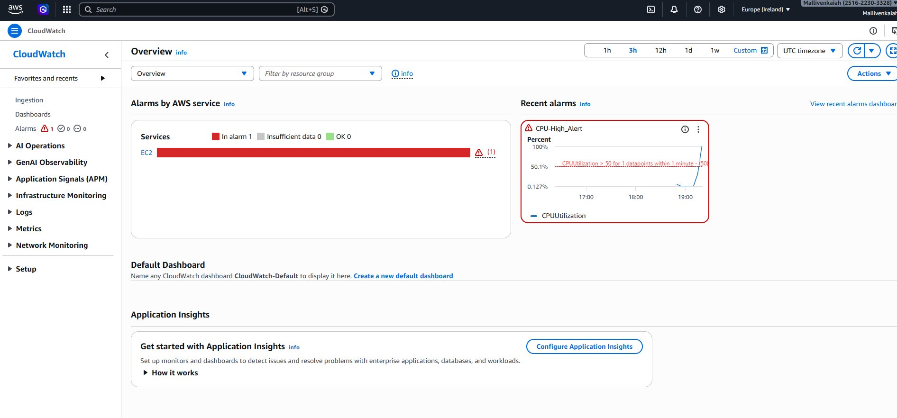
*Figure 6.1 - ALARM email received: Subject: ALARM: "CPU-High_Alert" in EU (Ireland)*

| Field | Value |
|-------|-------|
| Subject | ALARM: "CPU-High_Alert" in EU (Ireland) |
| Sender | AWS Notifications |
| State Change | OK → ALARM |
| CPU Value at Breach | 99.93% (1 out of last 1 datapoints exceeded the 50.0 threshold) |
| Timestamp | Friday 06 March 2026 - 19:21:40 UTC |
| Instance ID | i-006955522965f21a7 (Cloudwatch-Demo) |
| Metric | CPUUtilization - Namespace: AWS/EC2 - Period: 60s - Statistic: Average |
| AWS Account | 251622303328 - Region: eu-west-1 |
| Alarm ARN | arn:aws:cloudwatch:eu-west-1:251622303328:alarm:CPU-High_Alert |

### Step 7 - Resource Cleanup

Once I confirmed the alarm fired and the email arrived, I deleted everything immediately. This project stayed within the Free Tier so the cost was zero regardless, but I always clean up straight after any lab. In a real work environment a forgotten running instance can quietly add up to a large bill by the end of the month.

| Resource | Steps to Delete |
|----------|----------------|
| EC2 Instance | EC2 → Instances → Select Cloudwatch-Demo → Instance state → Terminate instance |
| CloudWatch Alarm | CloudWatch → Alarms → Select CPU-High_Alert → Actions → Delete |
| SNS Topic | SNS → Topics → Select cloudwatch-alarm-topic → Delete |
| Key Pair | EC2 → Network & Security → Key Pairs → Select cloudwatch-key → Delete |

## Full Project Configuration

| Item | Value |
|------|-------|
| EC2 Instance | Cloudwatch-Demo |
| Instance ID | i-006955522965f21a7 |
| Instance Type | t3.micro - 2 vCPU, 1 GB RAM - Free Tier |
| AMI | Amazon Linux 2023 (al2023-ami-2023.10.20260216.1-kernel-6.1-x86_64) |
| Public IP | 3.252.203.81 |
| Region | eu-west-1 (Europe - Ireland) |
| CloudWatch Alarm | CPU-High_Alert |
| Alarm Condition | CPUUtilization > 50 - Average - 1 min period - 1 out of 1 datapoints |
| SNS Topic | cloudwatch-alarm-topic - Standard type |
| Notification Endpoint | venkaiahmalli96@gmail.com - Email protocol - Confirmed |
| Stress Command | stress -c 2 -t 300 |
| Total Cost | €0.00 - all resources within AWS Free Tier |

## Cost Breakdown

| Service | Free Tier Limit | Used | Cost |
|---------|----------------|------|------|
| EC2 t3.micro | 750 hours/month | ~1 hour | €0.00 |
| CloudWatch Alarms | 10 alarms/month | 1 alarm | €0.00 |
| SNS Notifications | 1,000 emails/month | 2 emails | €0.00 |
| **Total** | | | **€0.00** |

## Skills Demonstrated

| Skill | What Was Done |
|-------|--------------|
| AWS EC2 | Launched t3.micro on Amazon Linux 2023, configured security group with SSH restricted to My IP only, connected via EC2 Instance Connect from the browser, terminated cleanly after verification |
| AWS CloudWatch | Created a CPU alarm with a 1-minute period and 50% threshold. Observed full state lifecycle: INSUFFICIENT_DATA on creation, OK once metrics started, IN ALARM at 99.93% CPU during the stress test |
| Amazon SNS | Created a Standard topic, added Gmail as a subscriber, confirmed the subscription, received the alarm email within 60 seconds of the CPU breach |
| Linux Administration | Installed stress via yum on Amazon Linux 2023, ran a 2-worker CPU load test for 5 minutes, monitored the spike in the CloudWatch graph in near real time |
| Cloud Monitoring | Built a complete end-to-end monitoring and alerting pipeline using only the AWS Console - no code, no scripts. Verified it works by triggering the alarm intentionally and confirming email delivery |
| Cost Management | Kept all resources within the Free Tier. Deleted EC2, alarm, SNS topic, and key pair immediately after verification. Total cost: €0.00 |

## Repository Structure

```
aws-cloudwatch-monitoring/
├── README.md                        # This file - full project documentation with screenshots
├── VM_AWS_CloudWatch_Project.pdf    # Complete project PDF with all AWS Console screenshots
└── screenshots/
    ├── 01-ec2-instance-running.png
    ├── 02-sns-topic-created.png
    ├── 03-sns-subscription-pending.png
    ├── 04-sns-confirmation-email.png
    ├── 05-sns-subscription-confirmed.png
    ├── 06-cloudwatch-metric-selected.png
    ├── 07-alarm-conditions-set.png
    ├── 08-sns-action-configured.png
    ├── 09-alarm-created-insufficient.png
    ├── 10-stress-tool-installed.png
    ├── 11-stress-test-running.png
    ├── 12-alarm-in-alarm-state.png
    ├── 13-cpu-graph-spike.png
    └── 14-alarm-email-received.png
```

## Author

**Venkaiah Malli**
AWS Certified Security Specialty | Solutions Architect | Cloud Practitioner
Dublin, Ireland
[github.com/venkaiahmalli96](https://github.com/venkaiahmalli96)
